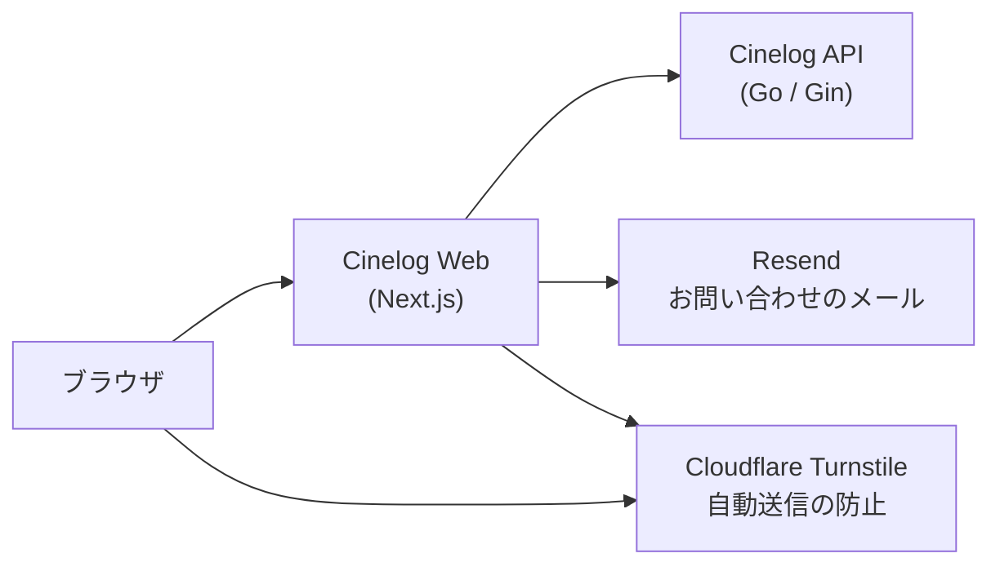

<div align="center">

# Cinelog

[English](README.md) | **日本語**

映画鑑賞記録アプリ「Cinelog」の Web アプリです。<br/>観た映画ごとに、ポスター、鑑賞日、スコア、気分、メモを記録できます。


</div>

本リポジトリでは、Cinelog の Web アプリを管理しています。データの取得と保存には [Cinelog API](https://github.com/masaya-nishimura-09/movie-log-api) を利用し、モックデータを使えば API なしでも動作します。[モバイルアプリ](https://github.com/masaya-nishimura-09/movie-log-mobile)もあります。

## 概要

記録にはプラットフォームと気分が残るため、観た映画をこれらの条件で絞り込めます。「Netflix で観られる、感動する映画はない？」と聞かれたときも、すぐに答えを見つけられます。

<p align="center">
  
</p>

<p align="center">
  
</p>

<p align="center">
  
</p>

## アーキテクチャ



ブラウザから API へは直接アクセスしません。Server Components と Server Actions がサーバー側で API を呼び出し、アクセストークンとリフレッシュトークンは HTTP-only の Cookie に保存します。言語の振り分け、ログイン画面へのリダイレクト、トークンの更新は `src/proxy.ts` が担います。

UI コンポーネントは、atoms、molecules、organisms の 3 層に分けています。

## 主な機能

**鑑賞記録**

- 鑑賞記録の作成・表示・更新・削除
- TMDB を利用した映画情報（公開年、上映時間、言語、制作国、ジャンル、クレジット、ポスター）の入力
- ポスター画像のアップロード
- カレンダーによる鑑賞日の選択（「今日」「昨日」の入力にも対応）

**記録の検索**

- タイトル検索、並べ替え、ページネーション
- スコア、プラットフォーム、気分、ジャンルによる絞り込み（スコアとプラットフォームは 1 つ、気分とジャンルは指定したすべてを含む記録のみ）

**アカウント**

- ユーザー登録、ログイン、ログアウト（トークンは自動で更新）
- アカウント情報の変更と退会

**お問い合わせ**

- Resend を利用した、メールで届くお問い合わせフォーム
- Cloudflare Turnstile と非表示の入力欄による、自動送信の防止

**画面**

- 日本語と英語（ブラウザの言語設定から自動で選択）
- ライトテーマとダークテーマ
- スマホと PC の両方に対応したレイアウト
- リンクを共有したときのプレビューカード（Open Graph）

**セキュリティと運用**

- Content-Security-Policy をはじめとするセキュリティヘッダーの付与
- 利用者単位のレート制限のための、クライアント IP と内部シークレットの API への送信
- サーバーのエラーと警告の構造化ログ（JSON）
- API なしで動作するモックモード

## デザイン

画面は 4 色で構成しています。赤は、エラーと削除にのみ使用します。


ほかの色は、すべて `src/styles/globals.css` でこの 4 色を混ぜて作っています。文字の太さは役割で使い分けており、本文は 400、押せる要素は 500、見出し・主要なボタン・スコアは 700 です。

## 技術スタック

| 分類             | 使用技術                                            |
|------------------|-----------------------------------------------------|
| フレームワーク   | Next.js（App Router）、React                        |
| 言語             | TypeScript                                          |
| スタイル         | Tailwind CSS、shadcn/ui（Base UI）、react-day-picker |
| バリデーション   | Zod                                                 |
| お問い合わせ     | Resend、Cloudflare Turnstile                        |
| 開発ツール       | Biome、pnpm                                         |

## セットアップ

### 前提条件

- Node.js 20.9 以上
- pnpm
- [Cinelog API](https://github.com/masaya-nishimura-09/movie-log-api)（モックモードでは不要）

### インストール

```bash
git clone https://github.com/masaya-nishimura-09/movie-log.git
cd movie-log
pnpm install
cp .env.example .env.local
# .env.local を編集し、各環境変数を設定する
pnpm dev
```

アプリは `http://localhost:3000` で起動します。

### モックモード

`USE_MOCK=true` を設定すると、API を使わずにモックデータで動作します。メールアドレス `demo@example.com`、パスワード `password` でログインできます。モックデータはメモリ上に保持され、サーバーを再起動すると初期状態に戻ります。

### 環境変数

`.env.local` に次の環境変数を設定してください。

| 変数                   | 必須/任意 | 説明                                                                 |
|------------------------|-----------|----------------------------------------------------------------------|
| `API_BASE_URL`         | 必須      | Cinelog API のベース URL（モックモードでは不要）                     |
| `USE_MOCK`             | 任意      | `true` にすると、API の代わりにモックデータを使用                    |
| `MOCK_DATASET`         | 任意      | `demo` にすると、モックモードで架空のデモ映画を使用                  |
| `MOCK_LANGUAGE`        | 任意      | `en` にすると、英語のモックデータを使用（それ以外は日本語）          |
| `INTERNAL_API_SECRET`  | 任意      | API との共有シークレット。クライアント IP 単位のレート制限に使用（API と同じ値を設定） |
| `APP_VERSION`          | 任意      | ログに記録するバージョン（Git のコミット ID など）                   |
| `RESEND_API_KEY`       | 任意      | Resend の API キー（お問い合わせフォームを使う場合は必須）           |
| `CONTACT_TO_EMAIL`     | 任意      | お問い合わせを受け取るメールアドレス（お問い合わせフォームを使う場合は必須） |
| `CONTACT_FROM_EMAIL`   | 任意      | お問い合わせのメールの送信元（既定値 `Cinelog <onboarding@resend.dev>`） |
| `TURNSTILE_SITE_KEY`   | 任意      | Cloudflare Turnstile のサイトキー（お問い合わせフォームを使う場合は必須） |
| `TURNSTILE_SECRET_KEY` | 任意      | Cloudflare Turnstile の秘密鍵（お問い合わせフォームを使う場合は必須） |

### スクリプト

| コマンド         | 説明                           |
|------------------|--------------------------------|
| `pnpm dev`       | 開発サーバーの起動             |
| `pnpm build`     | 本番用のビルド                 |
| `pnpm start`     | ビルドしたアプリの起動         |
| `pnpm lint`      | Biome によるチェック           |
| `pnpm fix`       | lint の指摘の自動修正          |
| `pnpm format`    | Biome による整形               |
| `pnpm typecheck` | TypeScript の型チェック        |

## ディレクトリ構成

```
src/
  app/                # ルーティング（[lang]/(app)、(auth)、(legal)）
  actions/            # Server Actions
  api/                # API クライアント、モックデータ
  components/         # UI コンポーネント（atoms、molecules、organisms）
  schemas/            # Zod スキーマ
  i18n/               # 言語設定、辞書
  lib/                # 補助関数（auth、contact、date、log、record、style、text、url）
  styles/             # グローバルスタイル、色の定義
  proxy.ts            # 言語の振り分け、トークンの更新
  instrumentation.ts  # 未処理のサーバーエラーのログ出力
```

## ページ

| パス                    | 内容                 | ログイン |
|-------------------------|----------------------|----------|
| /:lang                  | ランディングページ   | 不要     |
| /:lang/login            | ログイン             | 不要     |
| /:lang/register         | ユーザー登録         | 不要     |
| /:lang/about            | このアプリについて   | 不要     |
| /:lang/contact          | お問い合わせ         | 不要     |
| /:lang/terms            | 利用規約             | 不要     |
| /:lang/privacy          | プライバシーポリシー | 不要     |
| /:lang/records          | 鑑賞記録の一覧       | 必要     |
| /:lang/records/new      | 鑑賞記録の作成       | 必要     |
| /:lang/records/:id      | 鑑賞記録の詳細       | 必要     |
| /:lang/records/:id/edit | 鑑賞記録の編集       | 必要     |
| /:lang/account          | アカウント設定       | 必要     |

## クレジット

本アプリケーションは TMDB および TMDB API を使用していますが、TMDB による推奨、認定、その他の承認を受けたものではありません。
