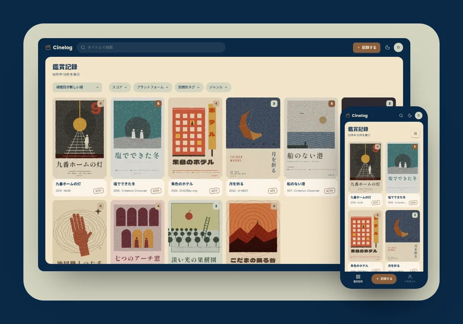
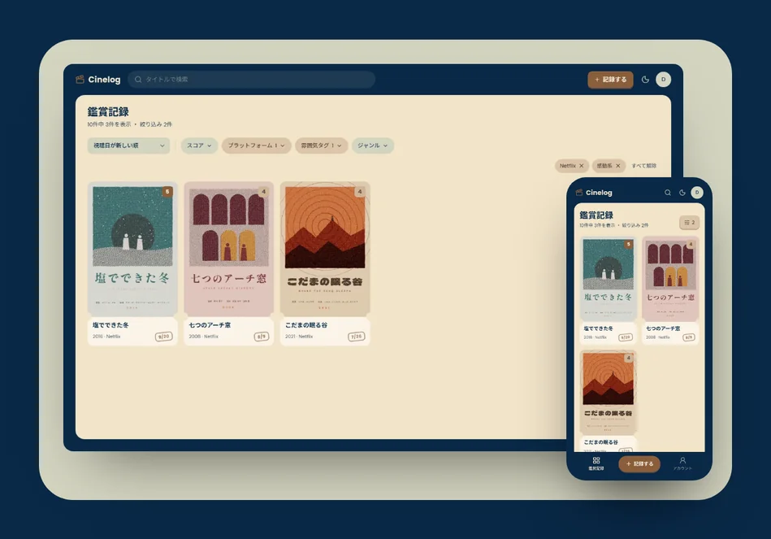
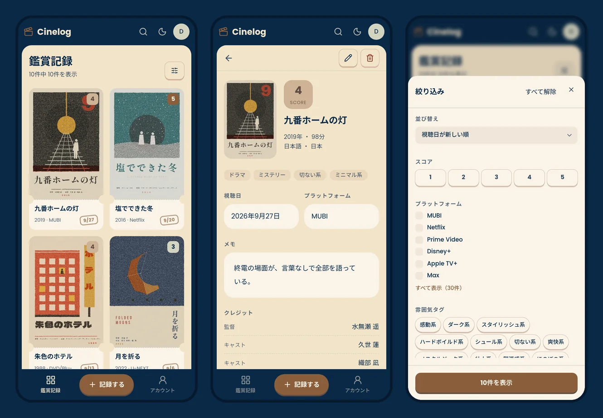
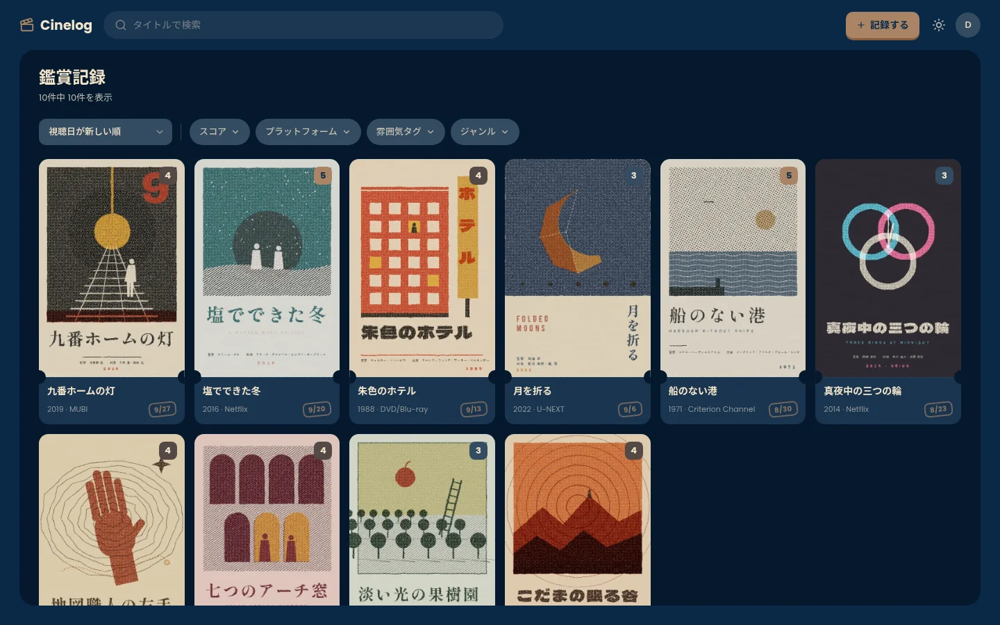

<div align="center">


# Cinelog

[English](README.md) | **日本語**

観た映画を、あとで思い出せるように。ポスター、観た日、スコア、気分、メモを1枚のカードに残すアプリです。




</div>

このリポジトリはフロントエンドです。[Movie Log API](https://github.com/masaya-nishimura-09/movie-log-api) とつないで動きます。モックデータを使えば、API なしでも動かせます。

## 聞かれたら、すぐにおすすめできる

> 「Netflix で観られる、感動する映画ない？」

映画が好きだと、おすすめを聞かれることがよくあります。でも相手の好みに合う1本は、その場ではなかなか思い出せません。記録にはプラットフォームと気分が残っているので、聞かれた条件で絞り込めば、自分が観た映画の中からすぐに答えられます。

<p align="center">
  
</p>

## 画面

<p align="center">
  
</p>

<p align="center">
  
</p>

## 機能

**記録**

- 観た映画の記録を作成・表示・編集・削除できる
- TMDB で映画を検索すると、公開年、上映時間、言語、製作国、ジャンル、クレジット、ポスターが入る
- ポスター画像を自分でアップロードできる
- 観た日はカレンダーから選べる。「今日」「昨日」のボタンもある

**記録を探す**

- タイトルで検索し、並び替えとページ送りができる
- スコア、プラットフォーム、気分、ジャンルで絞り込める

**アカウント**

- 登録、ログイン、ログアウト。トークンは自動で更新される
- アカウント情報の変更と退会

**全体**

- 日本語と英語。ブラウザの言語設定から選ばれる
- ライトテーマとダークテーマ
- スマホと PC のどちらにも対応
- バックエンドなしで動くモックモード

## デザイン

画面全体を4色で作っています。赤はエラーと削除にだけ使います。


ほかの色はすべて、この4色を `src/styles/globals.css` で混ぜて作っています。文字の太さは役割で決めています。読む文章は 400、押せるものは 500、見出し・主役のボタン・スコアは 700 です。

## 技術スタック

| 分野           | 使っているもの                                       |
|----------------|------------------------------------------------------|
| フレームワーク | Next.js (App Router), React                          |
| 言語           | TypeScript                                           |
| スタイル       | Tailwind CSS, shadcn/ui (Base UI), react-day-picker  |
| バリデーション | Zod                                                  |
| Lint・整形     | Biome                                                |
| パッケージ管理 | pnpm                                                 |

## はじめかた

### 必要なもの

- Node.js 20.9 以上
- pnpm
- [Movie Log API](https://github.com/masaya-nishimura-09/movie-log-api)
  (モックモードでは不要)

### インストール

```bash
git clone https://github.com/masaya-nishimura-09/movie-log.git
cd movie-log
pnpm install
cp .env.example .env.local
# .env.local を編集する
pnpm dev
```

### 設定

`.env.local` に次の値を設定します。

| 変数            | 説明                                               |
|-----------------|----------------------------------------------------|
| `API_BASE_URL`  | Movie Log API のベース URL                         |
| `USE_MOCK`      | `true` にすると API の代わりにモックデータを使う   |
| `MOCK_DATASET`  | `demo` にすると架空のデモ映画を使う(モックモード) |
| `MOCK_LANGUAGE` | `en` で英語のモック記録、それ以外は日本語          |

### モックモード

`USE_MOCK=true` のときは、`demo@example.com` / `password` でログインできます。モックデータはメモリ上にあり、サーバーを再起動すると元に戻ります。

### スクリプト

| コマンド         | 説明                       |
|------------------|----------------------------|
| `pnpm dev`       | 開発サーバーを起動する     |
| `pnpm build`     | 本番用にビルドする         |
| `pnpm start`     | ビルドしたものを起動する   |
| `pnpm lint`      | Biome でチェックする       |
| `pnpm fix`       | lint の指摘を直す          |
| `pnpm format`    | Biome で整形する           |
| `pnpm typecheck` | TypeScript の型チェック    |

## ディレクトリ構成

```
src/
  app/            # ルート ([lang]/(app), (auth), (legal))
  actions/        # Server Actions
  api/            # バックエンド API のクライアントとモックデータ
  components/     # UI コンポーネント (atoms / molecules / organisms)
  schemas/        # Zod スキーマ
  i18n/           # 言語設定と辞書
  lib/            # 補助関数 (auth, date, record, style, text, url)
  styles/         # 全体のスタイルと色の定義
  proxy.ts        # 言語の振り分けとトークンの更新
```

## ページ

| パス                    | 内容               | ログイン |
|-------------------------|--------------------|----------|
| /:lang                  | ランディングページ | 不要     |
| /:lang/login            | ログイン           | 不要     |
| /:lang/register         | 登録               | 不要     |
| /:lang/about            | このアプリについて | 不要     |
| /:lang/terms            | 利用規約           | 不要     |
| /:lang/privacy          | プライバシーポリシー | 不要   |
| /:lang/records          | 記録の一覧         | 必要     |
| /:lang/records/new      | 記録の作成         | 必要     |
| /:lang/records/:id      | 記録の詳細         | 必要     |
| /:lang/records/:id/edit | 記録の編集         | 必要     |
| /:lang/account          | アカウント設定     | 必要     |

## クレジット

This application uses TMDB and the TMDB APIs but is not endorsed,
certified, or otherwise approved by TMDB.
