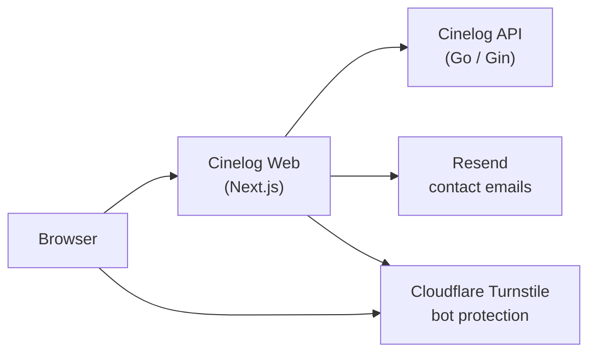

<div align="center">

# Cinelog

**English** | [日本語](README.ja.md)

The web app of Cinelog, an app for keeping a record of the films you watch.<br/>Each record keeps the poster, viewing date, score, mood, and notes for a film.


</div>

This repository contains the web app of Cinelog. It uses the
[Cinelog API](https://github.com/masaya-nishimura-09/movie-log-api)
for data and can also run on its own with mock data.
A [mobile app](https://github.com/masaya-nishimura-09/movie-log-mobile) is also available.

## Overview

Since every record includes the platform and mood, you can filter the films
you have watched by those conditions. When someone asks
"Is there anything moving on Netflix?", you can find an answer right away.

<p align="center">
  
</p>

<p align="center">
  
</p>

<p align="center">
  
</p>

## Architecture



The browser never calls the API directly. Server Components and
Server Actions call the API on the server, and the access and refresh tokens
are kept in HTTP-only cookies. `src/proxy.ts` handles language routing,
redirects to the login page, and token refresh.

UI components are organized into atoms, molecules, and organisms.

## Features

**Viewing records**

- Create, view, update, and delete viewing records
- Film details (release year, runtime, language, countries, genres, credits, and poster) filled in from TMDB
- Poster image uploads
- Viewing date selection from a calendar, with shortcuts for today and yesterday

**Finding records**

- Title search, sorting, and pagination
- Filtering by score, platform, mood, and genre
  (one score and one platform; moods and genres match only records that have all of them)

**Accounts**

- Registration, login, and logout, with automatic token refresh
- Account updates and deletion

**Contact**

- A contact form that sends messages by email through Resend
- Protection against automated submissions with Cloudflare Turnstile and a hidden field

**Interface**

- Japanese and English, chosen from the browser language
- Light and dark themes
- Layouts for phones and desktops
- Preview cards for shared links (Open Graph)

**Security and operations**

- Security headers on every response, including Content-Security-Policy
- The client IP and an internal secret sent to the API so it can rate limit per visitor
- Structured JSON logs for server errors and warnings
- A mock mode that runs without the API

## Design

The interface is built from four colors, with red reserved for errors and deletion.


All other colors are mixed from these four in `src/styles/globals.css`.
Font weights depend on the role of the text: 400 for body text,
500 for anything that can be pressed, and 700 for headings, primary buttons, and scores.

## Tech Stack

| Category   | Technologies                                          |
|------------|-------------------------------------------------------|
| Framework  | Next.js (App Router), React                           |
| Language   | TypeScript                                            |
| Styling    | Tailwind CSS, shadcn/ui (Base UI), react-day-picker   |
| Validation | Zod                                                   |
| Contact    | Resend, Cloudflare Turnstile                          |
| Tooling    | Biome, pnpm                                           |

## Setup

### Prerequisites

- Node.js 20.9 or later
- pnpm
- [Cinelog API](https://github.com/masaya-nishimura-09/movie-log-api)
  (not required in mock mode)

### Installation

```bash
git clone https://github.com/masaya-nishimura-09/movie-log.git
cd movie-log
pnpm install
cp .env.example .env.local
# Edit .env.local and set each environment variable
pnpm dev
```

The app starts on `http://localhost:3000`.

### Mock Mode

When `USE_MOCK=true`, the app runs on mock data without the API.
Log in with `demo@example.com` and the password `password`.
Mock data is kept in memory and resets when the server restarts.

### Environment Variables

Set the following environment variables in `.env.local`.

| Variable               | Required | Description                                                         |
|------------------------|----------|---------------------------------------------------------------------|
| `API_BASE_URL`         | Required | Base URL of the Cinelog API (not required in mock mode)             |
| `USE_MOCK`             | Optional | Set to `true` to use mock data instead of the API                   |
| `MOCK_DATASET`         | Optional | Set to `demo` to use the fictional demo films in mock mode          |
| `MOCK_LANGUAGE`        | Optional | Set to `en` for English mock records (Japanese otherwise)           |
| `INTERNAL_API_SECRET`  | Optional | Secret shared with the API for rate limiting by client IP (must match the API's value) |
| `APP_VERSION`          | Optional | Version written to logs, such as the Git commit hash                |
| `RESEND_API_KEY`       | Optional | Resend API key (required for the contact form)                      |
| `CONTACT_TO_EMAIL`     | Optional | Address that receives contact messages (required for the contact form) |
| `CONTACT_FROM_EMAIL`   | Optional | Sender of contact emails (default: `Cinelog <onboarding@resend.dev>`) |
| `TURNSTILE_SITE_KEY`   | Optional | Cloudflare Turnstile site key (required for the contact form)       |
| `TURNSTILE_SECRET_KEY` | Optional | Cloudflare Turnstile secret key (required for the contact form)     |

### Scripts

| Command          | Description                     |
|------------------|---------------------------------|
| `pnpm dev`       | Start the development server    |
| `pnpm build`     | Build for production            |
| `pnpm start`     | Start the production build      |
| `pnpm lint`      | Check the code with Biome       |
| `pnpm fix`       | Fix lint issues                 |
| `pnpm format`    | Format the code with Biome      |
| `pnpm typecheck` | Run the TypeScript type check   |

## Project Structure

```
src/
  app/                # Routes ([lang]/(app), (auth), (legal))
  actions/            # Server Actions
  api/                # API clients and mock data
  components/         # UI components (atoms, molecules, organisms)
  schemas/            # Zod schemas
  i18n/               # Locales and dictionaries
  lib/                # Helpers (auth, contact, date, log, record, style, text, url)
  styles/             # Global styles and color tokens
  proxy.ts            # Language routing and token refresh
  instrumentation.ts  # Logging of unhandled server errors
```

## Pages

| Path                    | Description        | Login        |
|-------------------------|--------------------|--------------|
| /:lang                  | Landing page       | Not required |
| /:lang/login            | Login              | Not required |
| /:lang/register         | Registration       | Not required |
| /:lang/about            | About the app      | Not required |
| /:lang/contact          | Contact form       | Not required |
| /:lang/terms            | Terms of use       | Not required |
| /:lang/privacy          | Privacy policy     | Not required |
| /:lang/records          | Record list        | Required     |
| /:lang/records/new      | New record         | Required     |
| /:lang/records/:id      | Record details     | Required     |
| /:lang/records/:id/edit | Record editing     | Required     |
| /:lang/account          | Account settings   | Required     |

## Credits

This application uses TMDB and the TMDB APIs but is not endorsed,
certified, or otherwise approved by TMDB.
