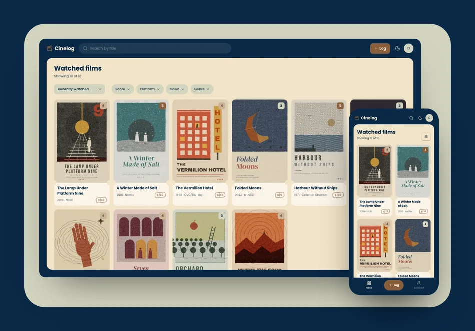
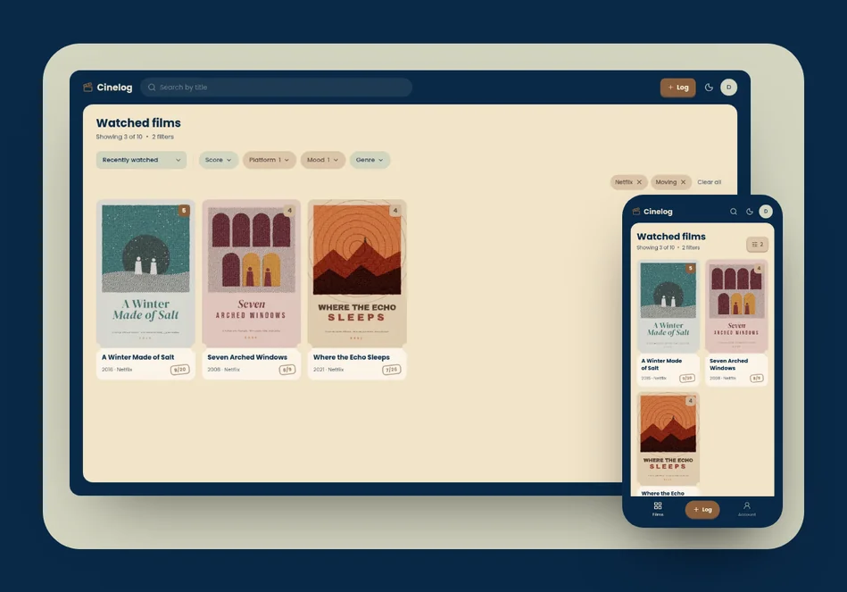
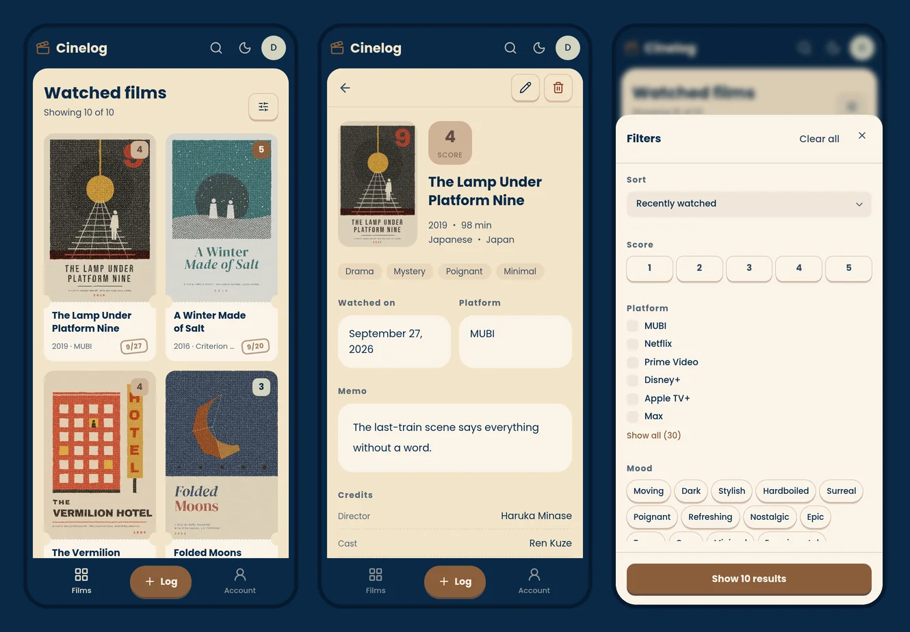
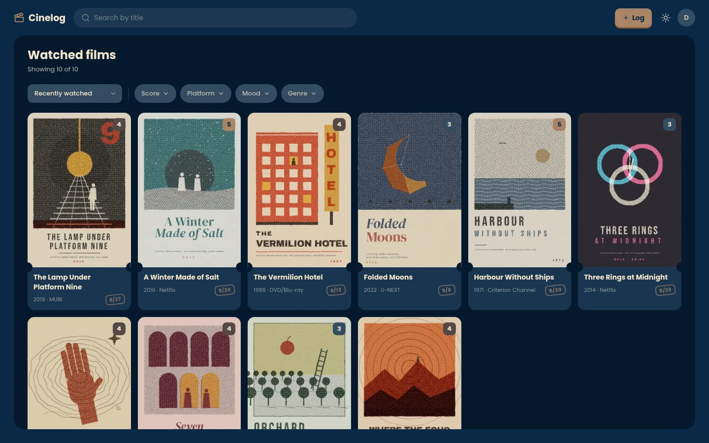

<div align="center">


# Cinelog

**English** | [日本語](README.ja.md)

A quiet place to log the films you watch:
the poster, the date, a score, the mood and a memo, all on one card.




</div>

This repository is the web frontend.
It talks to [Movie Log API](https://github.com/masaya-nishimura-09/movie-log-api),
and can also run on its own with mock data.

## Recommend a film in seconds

> "Anything moving on Netflix?"

If you love films, people keep asking you what to watch,
and the right pick for someone else rarely comes to mind on the spot.
Every record keeps its platform and mood,
so you can filter the films you have seen down to exactly what they asked for
and answer right away.

<p align="center">
  
</p>

## Screens

<p align="center">
  
</p>

<p align="center">
  
</p>

## Features

**Records**

- Create, view, edit and delete records of the films you watch
- Look up a film on TMDB to fill in its year, runtime, language, countries,
  genres, credits and poster
- Upload your own poster image
- Pick the watched date from a calendar, or tap Today / Yesterday

**Finding records**

- Search by title, sort, and page through the list
- Filter by score, platform, mood and genre

**Account**

- Register, log in and log out, with tokens refreshed automatically
- Update or delete your account

**Everywhere**

- English and Japanese, chosen from the browser language
- Light and dark themes
- Layouts for phones and desktops
- Mock mode that runs without the backend

## Design

The whole UI is built from four colors, plus red for errors and deletion.


Every other color is mixed from these in `src/styles/globals.css`.
Font weights follow the role of the text:
400 for text to read, 500 for anything you can press,
and 700 for headings, primary buttons and scores.

## Tech Stack

| Area        | Tools                                               |
|-------------|-----------------------------------------------------|
| Framework   | Next.js (App Router), React                         |
| Language    | TypeScript                                          |
| Styling     | Tailwind CSS, shadcn/ui on Base UI, react-day-picker |
| Validation  | Zod                                                 |
| Lint/format | Biome                                               |
| Packages    | pnpm                                                |

## Getting Started

### Prerequisites

- Node.js 20.9+
- pnpm
- [Movie Log API](https://github.com/masaya-nishimura-09/movie-log-api)
  (not needed in mock mode)

### Installation

```bash
git clone https://github.com/masaya-nishimura-09/movie-log.git
cd movie-log
pnpm install
cp .env.example .env.local
# Edit .env.local with your configuration
pnpm dev
```

### Configuration

Set these in `.env.local`:

| Variable        | Description                                          |
|-----------------|------------------------------------------------------|
| `API_BASE_URL`  | Base URL of Movie Log API                            |
| `USE_MOCK`      | `true` to use mock data instead of the API           |
| `MOCK_DATASET`  | `demo` to use the fictional demo films (mock mode)   |
| `MOCK_LANGUAGE` | `en` for English mock records, Japanese otherwise    |
| `INTERNAL_API_SECRET` | Shared secret sent to the API with the client IP for rate limiting (same value as the API) |
| `APP_VERSION`   | Version written to server logs, such as the Git commit hash |

### Mock mode

With `USE_MOCK=true`, log in with `demo@example.com` / `password`.
Mock data lives in memory and resets when the server restarts.

### Scripts

| Command          | Description                |
|------------------|----------------------------|
| `pnpm dev`       | Start the dev server       |
| `pnpm build`     | Build for production       |
| `pnpm start`     | Start the production build |
| `pnpm lint`      | Check with Biome           |
| `pnpm fix`       | Fix lint issues            |
| `pnpm format`    | Format with Biome          |
| `pnpm typecheck` | Run the TypeScript check   |

## Project Structure

```
src/
  app/            # Routes ([lang]/(app), (auth), (legal))
  actions/        # Server Actions
  api/            # Backend API clients and mock data
  components/     # UI components (atoms / molecules / organisms)
  schemas/        # Zod schemas
  i18n/           # Locales and dictionaries
  lib/            # Helpers (auth, date, record, style, text, url)
  styles/         # Global styles and color tokens
  proxy.ts        # Locale routing and token refresh
```

## Pages

| Path                    | Description      | Auth |
|-------------------------|------------------|------|
| /:lang                  | Landing page     | No   |
| /:lang/login            | Login            | No   |
| /:lang/register         | Register         | No   |
| /:lang/about            | About the app    | No   |
| /:lang/terms            | Terms of use     | No   |
| /:lang/privacy          | Privacy policy   | No   |
| /:lang/records          | List records     | Yes  |
| /:lang/records/new      | Create a record  | Yes  |
| /:lang/records/:id      | Record detail    | Yes  |
| /:lang/records/:id/edit | Edit a record    | Yes  |
| /:lang/account          | Account settings | Yes  |

## Credits

This application uses TMDB and the TMDB APIs but is not endorsed,
certified, or otherwise approved by TMDB.
